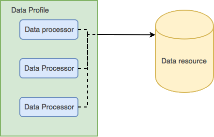

# Data Profiles

A data profile is an entity that's main purpose is to group together data processors by user preference. A data profile can be created and then data processors associated with it. Assigning a data profile to a data resource will run all the associated data processors against the data resource.

## Overview
A list of data profiles can be accessed by clicking on the 'Data Profiles' link in the main menu on the left hand side of the Lintol interface. Each entry in data profile list summarises the following information:

- Name
- Description
- Created date
- Last updated date
- Version
- Unique reference

<!--## Filtering

The list of data profiles can be refined by selecting a group from the filter dropdown list at the top of the data profiles list. Once a group has been selected it will automatically refine the list to data profiles which are members of that group.
-->
## Add a Data Profile

Clicking on the "Add a Data Profile" button on the top right of the data profiles page will display the new data profile page. A name must be entered in the "Name" input and a description in the "Description" input.

At least one data processor must be added to a data profile. Data processors can be found by typing a search term into the "Search for a Processor" input or by scrolling through the dropdown input of search entries. Search entries show the name and a brief description of the data processor. Once the desired data processor has been found it can be added to the data profile by clicking on the "Add" button on the right of the data processor search entry.

<!--Further details about the data processor can be viewed by clicking on the "More Details" button in the data processor search entry. Data processors can also be attached to the data profile from the details popup by clicking on the "Add Processor" button in the top right of the popup.-->

Data processors with specific options can be configured by clicking on the "Edit" link when selecting processors for a profile. For more details on data processors, view the [Data Processors](./Processors) section of the documentation

## Edit a Data Profile

Selecting the 'Edit' action on the right side of a data profile entry will display the edit data profile page. The "Name", "Description" and associated processors can all be changed. Once the information has been edited, the changes can be saved by clicking on the 'Update Profile' button.

## Output Artifacts

The type of artifact that a processor produces can be selected by clicking on the "Output Artifacts" link on the right side of the data profile entry.

## Removing a Data Profile
Clicking on the 'X' on the right side of the data profile entry will remove the data profile from the list of active data profiles.

## Configure Profile Rules
There are some options to configure how the profile behaves

### Can run automatically
This option will allow the profile to run automatically. 

### Only run this profile if all its processors can run (on a resource)
This option will only run the profile if each of it's processor can be run against the dataset provided. If any processor is unable to run then the whole profile will not be run. If this option is not selected then any individual processor in the profile will run if it is able and processors which are unable to run will be ignored.